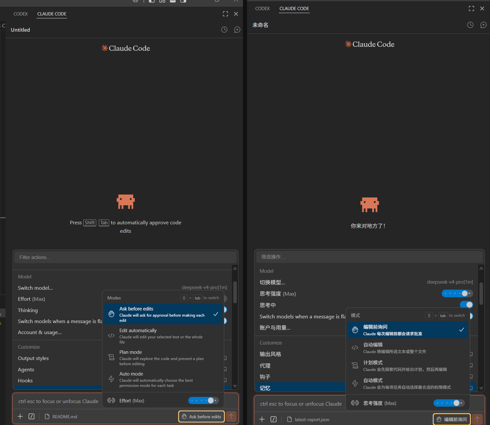
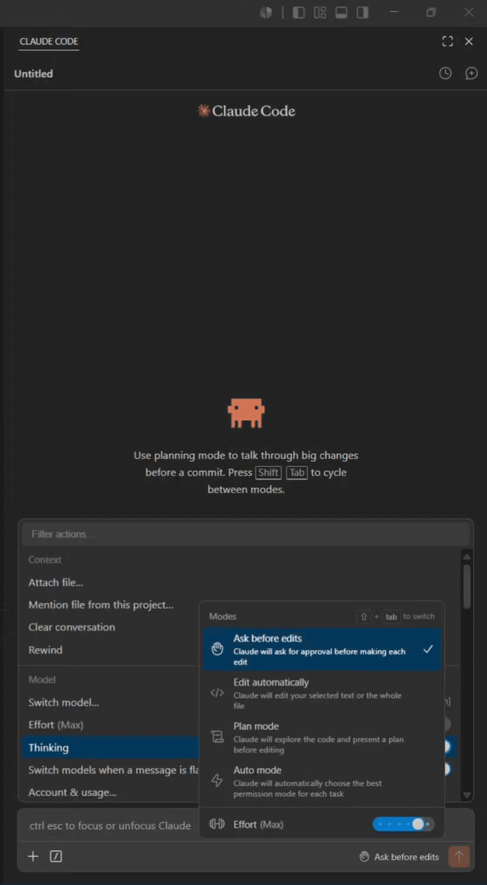
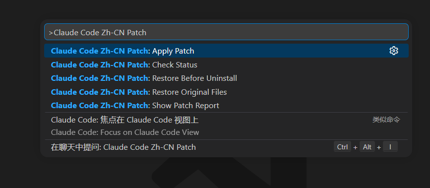
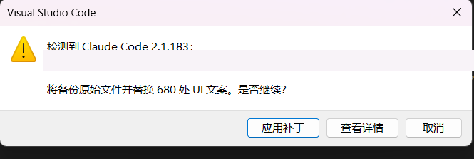
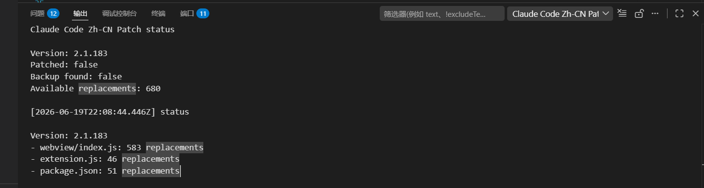
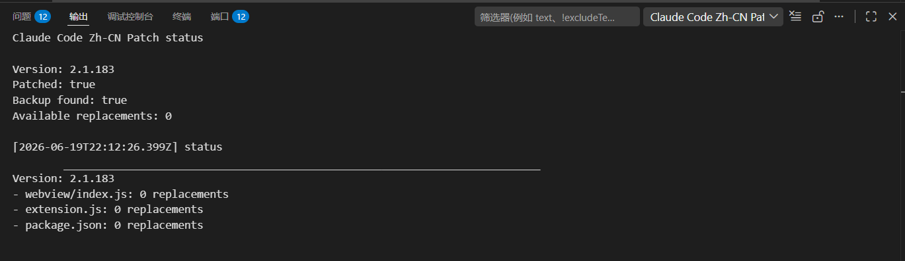
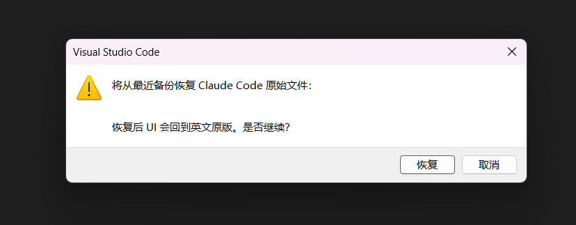

# Claude Code Zh-CN Patch Helper

[简体中文](./README.md) | English

An unofficial, user-triggered Simplified Chinese UI patch helper for the official Claude Code VS Code extension.

[](https://github.com/shanjiancaofu/claude-code-vscode-zh-cn/actions/workflows/ci.yml)
[](https://github.com/shanjiancaofu/claude-code-vscode-zh-cn/releases)
[](https://marketplace.visualstudio.com/items?itemName=shanjiancaofu.claude-code-zh-cn-patch-helper)
[](https://marketplace.visualstudio.com/items?itemName=shanjiancaofu.claude-code-zh-cn-patch-helper)
[](./LICENSE)

This project does **not** contain or redistribute Claude Code, modified VSIX packages, or Anthropic source code. It only patches visible UI strings in a locally installed official extension after explicit user confirmation.

## Install and get started

1. Install the official `Claude Code for VS Code` extension.
2. Install this helper from the [VS Code Marketplace](https://marketplace.visualstudio.com/items?itemName=shanjiancaofu.claude-code-zh-cn-patch-helper), or search for `Claude Code Zh-CN Patch Helper` in the Extensions view.
3. Open the Command Palette (`Ctrl+Shift+P`) and run `Claude Code Zh-CN Patch: Apply Patch`.
4. Review the target directory and replacement count, then confirm.
5. Run `Developer: Reload Window`.

Command-line installation:

```bash
code --install-extension shanjiancaofu.claude-code-zh-cn-patch-helper
```

> Installing this helper does not modify Claude Code automatically. Files are changed only after the user explicitly runs and confirms `Apply Patch`.

## Preview

### Before and after



### Patch result

<p align="center">
  
</p>

<details>
<summary>Show Command Palette</summary>



</details>

<details>
<summary>Show the complete patch and restore workflow</summary>

#### Apply confirmation



#### Status before applying



#### Status after applying



#### Restore confirmation



</details>

## Features

- Shared TypeScript core for both CLI and VS Code commands
- Detects VS Code, Remote SSH, WSL, Dev Containers, Cursor, Windsurf, VSCodium and code-server installations
- Dry-run preview before writing
- External timestamped backups with SHA-256 manifests
- Safe restore with version and checksum validation
- Status checks and JSON patch reports
- No telemetry, uploads, or access to project source code

## Other installation methods

### Source usage

```bash
git clone https://github.com/shanjiancaofu/claude-code-vscode-zh-cn.git
cd claude-code-vscode-zh-cn
npm install
npm run status
npm run dry-run
npm run apply
```

Restore the original files before uninstalling this tool:

```bash
npm run restore
```

Pass a non-standard extension location after `--`:

```bash
npm run apply -- --target /path/to/anthropic.claude-code-version
```

### VSIX usage

Download the latest `.vsix` from [GitHub Releases](https://github.com/shanjiancaofu/claude-code-vscode-zh-cn/releases), or build it locally:

```bash
npm run compile
npm run package
code --install-extension claude-code-zh-cn-patch-helper-0.1.2.vsix
```

Then open the Command Palette and run:

- `Claude Code Zh-CN Patch: Apply Patch`
- `Claude Code Zh-CN Patch: Restore Original Files`
- `Claude Code Zh-CN Patch: Restore Before Uninstall`
- `Claude Code Zh-CN Patch: Check Status`
- `Claude Code Zh-CN Patch: Show Patch Report`

## Important behavior

The helper modifies only these files inside a validated `anthropic.claude-code-*` directory:

- `extension.js`
- `webview/index.js`
- `package.json`

Backups and reports are stored outside extension directories under `~/.claude-code-zh-cn-patch/`. Updating Claude Code normally creates a new extension directory, so the patch must be applied again. Uninstalling this helper does not automatically undo an existing patch.

## Documentation

- [Usage](./docs/usage.md)
- [Compatibility](./docs/compatibility.md)
- [FAQ](./docs/faq.md)
- [Contributing](./CONTRIBUTING.md)
- [Screenshot and GIF guide](./docs/screenshots.md)

If this project helps, consider giving it a ⭐ Star so more Chinese Claude Code users can find it.

## Disclaimer

This project is unofficial and is not affiliated with or endorsed by Anthropic. Claude Code and related trademarks belong to Anthropic. Users must install the official Claude Code extension separately.

## License

The helper code and community translation data are licensed under the [MIT License](./LICENSE). This license does not apply to Claude Code itself.
